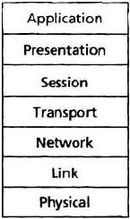

+++
description = ""
date = "2017-06-21T15:23:36+08:00"
title = "Network Protocol Layering"
categories = []
tags = []
images = []
banner = ""
menu = ""

+++

## Protocol Layering
* Five-layer Internet protocol statck

### Application Layer -- Message
The application layer is where network applications and their application-layer protocols side.
The Internet's application layer includes many protocols, such as the HTTP protocol, SMTP, and FTP.
An application-layer protocol is distributed over mutiple end systems, with the application in one 
end system using the protocol to exchange packets of information with the application in another 
end system. 

### Transport Layer -- Segment
The Internet's transport layer transports application-layer messages between application endpoints. 
In the internet there are 2 transport protocols. TCP and UDP, either of which can transport 
application-layer messages. TCP provides a connection-oriented service to its applications. 
This service includes guaranteed delivery of application-layer messages to the distination and flow 
control. TCP also breaks long messages into short segments and provides congestion-control mechanism, 
so that a source throttles its transmission rate when the network is congested. The UDP protocol provides 
a connectionless service to its applications. This is no- frills service that provides no reliability, 
no flow control, and no congestion control.

### Network Layer -- Datagrams
The Internet's network layer is responsible for moving network-layer packets known as datagrams from one 
host to another. The Internet's transport-layer protocol(UDP or TCP) in a source host passes a transport-layer 
segment and a distination address to the network layer, just like you would give the postal service a letter 
with a distination address. The network layer then provides the service of delivering the segment to transport 
layer in the destination host. 

The Internet's network layer includes the celebrated IP Protocol, which defines the fields in the datagram 
as well as how the end systems and routers act on these fields. There's only one IP protocol, and all Internet 
components that have the network layer must run the IP protocol. The Internet's network layer also includes 
routing protocols that determine the routers that datagrams take between sources and destinations.
The Internet has many routing protocols. Although the network layer contains both IP protocol and routing 
protocols, it's often simply referred to as the IP layer, reflecting the fact that IP is the glue that 
binds the Internet together.

### Link Layer -- Frames
The Internet's network layer routes a datagram through a series of routers between the source and destination. 
To move a packet from one node to the next node in the route, the network layer relies on the services of the 
link layer. In particular, at each node, the network layer passes the datagram down to the link layer, which 
delivers the datagram to the next node along the route. At this next node, the link layer passes the datagram 
up to the network layer.

The services provided by the link layer depend on the specific link-layer protocol that is employed over the 
link. For example, some link-layer protocols provide reliable delivery, from transmitting node, over one link, 
to receiving node. The network layer will receive a different service from each of the different link-layer 
protocols.

### Physical Layer
While the job of the link layer is to move entire frames from one network element to an adjacent network 
element, the job the physical layer is to move the individual bits within the frame from one node to the 
next. The protocols in this layer are again link dependent and future depend on the actual transmission 
medium of the link. For example, Ethernet has many physical-layer protocols: one for twisted-pair copper 
wire, another for coaxial cable, another for fiber, and so on. In each case, a bit is moved across the link 
in a different way.

* Seven-layer ISO OSI reference model

### The OSI Model
The Internet Origanization for Standardization(ISO) proposed that computer networks be organized around seven 
layers, call the Open Systems Interconnection(OSI) model. The seven layers of OSI reference model are: 
application layer, presentation layer, session layer, transport layer, network layer, data link layer, 
and physical layer. The functionality of live of these layers is roughly the same as their similarly named 
Internet counterparts.

The role of presentation layer is to provide services that allow communicating application to interpret the 
meaning of data exchanged. The services include data compression and data encryption as well as data description. 

The session layer provides for delimiting and synchronization of data exchange, including the means to build 
a checkpointing and recovery scheme.
